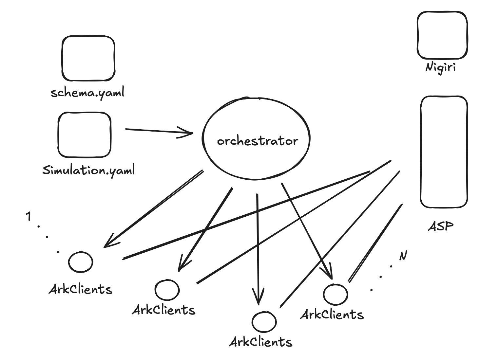

# Simulation Framework for Ark Server Testing

This simulation framework tests the **Ark Server** by simulating multiple clients performing various actions over several rounds. It utilizes YAML configuration files and validates them against a predefined schema.

## Architecture

The simulation framework is structured as follows:

1. **Configuration Files**:
    - `schema.yaml`: Defines the structure and rules for configuration files used in simulations.
    - `Simulation.yaml`: The main configuration file, following `schema.yaml`, specifies the parameters for each simulation.

2. **Orchestrator**:
    - Acts as the main controller, reading configurations from `schema.yaml` and `Simulation.yaml`.
    - Start ASP and Ark Clients and orchestrates the interactions between them based on the defined simulation scenarios.
    - Supports both single-process and multi-process simulations for flexible testing.

3. **Ark Clients**:
    - Represent individual Ark Client that interact with the **Ark Server** based on orchestrated instructions.
    - Multiple Ark Clients can run in parallel, enabling the simulation of a network of users with varying behaviors.

4. **External Dependencies**:
    - **Nigiri**: Provides a local Bitcoin Regtest environment, necessary for simulating blockchain-related actions.
    - **Ark Server**: The server under test, which receives requests from Ark Clients and processes them accordingly.

<p align="center">
  
</p>

## Usage

The simulation can be run either locally or on AWS.

### Local Deployment

For smaller tests, local deployment allows for a quick setup:

- **Single process**: The orchestrator and Ark Clients run in the same process.
- **Multi-process**: The orchestrator and clients run as separate processes, mimicking a more realistic client-server interaction.

#### Prerequisites

1. **Start Nigiri (Bitcoin Regtest environment)**:
   ```bash
   nigiri start
   ```

2. **Configure Testing Scenario**:
    - Create a simulation YAML file based on the `schema.yaml` format.
    - Check out the example configuration for guidance.

3. **Run Simulation**:
   ```bash
   # Single-process mode:
   make run-single

   # Multi-process mode:
   make run-multi
   ```

### AWS Deployment
As more users join the round, VTXO tree grows and there will be more transactions to sign by each user.
Considering signing is expensive operation, it quickly becomes a bottleneck in the simulation, as it drains the CPU resources.
To overcome this and to provide a more realistic simulation, this framework supports running the simulation in AWS.

#### Prerequisites

1. **Create AWS SSH Keys**:
    - Go to AWS EC2 Console > Key Pairs
    - Create a new key pair and save the private key file (`.pem`)

#### Setup Process

1. **Deploy CloudFormation Stack**:
    - Upload the CloudFormation template file to AWS CloudFormation
    - Fill in the mandatory parameters:
        - Stack name
        - SSH key pair (select the one created in prerequisites)
        - Ark GitHub URL
        - Branch name (defaults to master)

2. **Get Infrastructure Details**:
    - Once CloudFormation stack creation is complete, go to the Outputs tab
    - Note down the following values:
        - `SUBNET_IDS`
        - `SECURITY_GROUP_IDS`

3. **Verify Installation**:
    - SSH into the EC2 instance
    - Check installation progress:
      ```bash
      less /var/log/cloud-init-output.log
      ```
    - Verify that the Ark Client Docker image has been successfully pushed to ECR

4. **Run Remote Simulation**:
   ```bash
   cd ./ark/simulation
   SUBNET_IDS={SUBNET_IDS} SECURITY_GROUP_IDS={SECURITY_GROUP_IDS} make run-remote
   ```
5. **Run Remote Simulation in Signet**:   
   ```bash
   cd ./ark/simulation
   export SUBNET_IDS={SUBNET_IDS}
   export SECURITY_GROUP_IDS={SECURITY_GROUP_IDS}
   SUBNET_IDS={SUBNET_IDS} SECURITY_GROUP_IDS={SECURITY_GROUP_IDS} make run-remote-signet ARGS="--asp-url {URL} --signet"
   ```