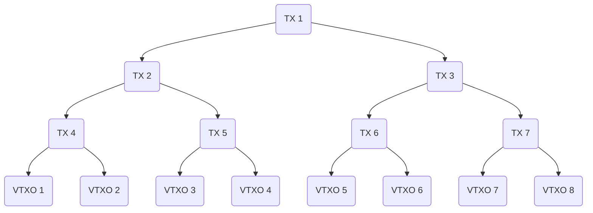
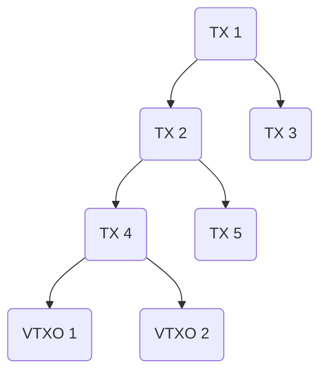

### Overview

Alice wants to leave the Ark and get her funds back on-chain. It requires an on-chain transaction.

### Cooperative exit

#### Timeline of events

1. Alice tells ASP she wants to trade [VTXO](./nomenclature#vtxo-1) for UTXO
2. ASP (with Alice) prepares next [Pool transaction](./nomenclature#pool-transaction-aka-ark-transaction):
   - an additional output is added, locked by `Alice`
3. Alice creates a [Forfeit transaction](./nomenclature#forfeit-transaction):
   - spends from VTXO (1) with `Alice + ASP`
   - adds connector output from Pool transaction (2) as input
   - signs it and send it to the ASP
4. ASP broadcasts [Pool transaction](./nomenclature#pool-transaction-aka-ark-transaction)
5. Alice has now a new UTXO
6. For at most 4 weeks, Alice will be able to double spend her [VTXO](./nomenclature#vtxo-1), but if she does it, the ASP will have time (24 hours) to grab the funds from the [VTXO](./nomenclature#vtxo-1) to itself using the [Forfeit transaction](./nomenclature#forfeit-transaction)

### Non-cooperative exit

If ASP is unresponsive, Alice can unilaterally exit revealing the branch of the Pool transaction that locks her funds.

#### Timeline of events

1. Assuming a [VTXO](./nomenclature#vtxo-1) tree with radix of 2 and 8 [VTXOs](./nomenclature#vtxo-1):

2. Assuming VTXO 1 and 2 belong to Alice and Bob
3. Alice reveals the [VTXO](./nomenclature#vtxo-1) tree to spend the [Shared Output](./nomenclature#shared-output-aka-shared-utxo).
4. Alice doesn't need to reveal the entire tree, just enough to validate it:

5. Alice will need to wait 24 hours to be able to spend her [VTXO](./nomenclature#vtxo-1). This gives enough time to the ASP to prevent any double spend attempts by Alice.
6. Bob can also spend his [VTXO](./nomenclature#vtxo-1) in 24 hours, or do nothing and maintain his [VTXO](./nomenclature#vtxo-1) on the Ark.
