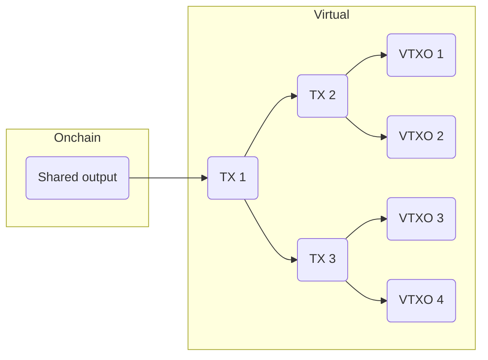
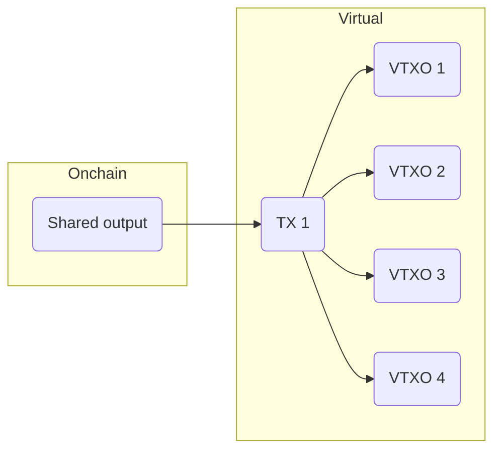

:::info
🚧 This page is currently under development, and some concepts may not be entirely accurate. We greatly value your feedback and contributions. If you have any suggestions, corrections, or would like to submit edits, please do so through the pull request link available at the bottom of each page.
:::

## Intervenients

### ASP

ASPs are always-on servers that provide liquidity to the network, similar to how Lightning service providers work.

### Users

Any user that onboards the Ark or receives a payment inside an Ark.

### VTXO

Ark has a UTXO set that lives off the chain. These utxos are referred to as virtual UTXOs or VTXOs in short.

## Moments

### Boarding the Ark

When a User sends funds to the Ark and gets VTXOs in return.

### Unilateral exit

When a user decides to withdraw his funds from the Ark to mainchain, without asking the ASP for permission.

### Round

Periodic transaction crafted by the ASP that hits mainchain and creates new VTXOs.

## Transactions

### Notes

- In an optimistic scenario, transactions marked with a **\*** should never hit onchain.
- All time periods used on timelocks (**5s**, **24h**, **4w**, **1y**) are arbitrary: any ASP can use different values.

### Legend

- **A**: Alice pubkey
- **ASP**: ASP pubkey
- **cov\*\*(script)**: covenant that forces the spending transaction to have a mandatory first output with the **script**
- **and(A,B)**: both conditions needed to unlock
- **or(A,B)**: only one condition needed to unlock
- **and(A, or(S, after(24h)**: (Alice and Server) or (Alice after 24h)

### VTXO\*

- A Virtual UTXO: it looks like an UTXO but it should never hit onchain, thus a Virtual UTXO

| Inputs                       | Outputs                              |
| ---------------------------- | ------------------------------------ |
| Boarding or Pool transaction | `(Alice + ASP) or (Alice after 24h)` |

### Boarding transaction

There are 2 different ways a user can board the Ark:

- With luggage
- Without luggage

Different ASPs can use different ways for users to board their Ark.

#### With luggage

- Initially proposed by [Steven Roose](https://roose.io/presentations/understanding-ark.pdf)
- Alice funds an output that can be **accepted as a VTXO** in a future round
- A covenant forces the creation of an output with the same script as [**VTXO**](#VTXO). No need for interactivity after funding it, anyone can spend.
- **ASP** can unlock after a timeout ie. _4 weeks_
- Alice is **required to be online** to maintain access to funds: after the timeout, ASP becomes the only owner funds

| Inputs       | Outputs                                                     |
| ------------ | ----------------------------------------------------------- |
| Alice’s UTXO | `(ASP after 4w) or cov((Alice + ASP) or (Alice after 24h))` |

#### Without luggage

- Initially proposed by [Burak](https://lists.linuxfoundation.org/pipermail/bitcoin-dev/2023-May/021694.html)
- Alice funds an output that can be **accepted as a VTXO** in a future round
- If ASP is not cooperative, **Alice** can unlock after a timeout ie. _1 year_
- Alice is **not required to be online** to maintain access to funds: after the timeout, she becomes the only owner of the funds

| Inputs       | Outputs                             |
| ------------ | ----------------------------------- |
| Alice’s UTXO | `(Alice after 1y) or (Alice + ASP)` |

### Forfeit transaction\*

- Insurance for the ASP, in case Alice tries to double spend her VTXO after spending it inside Ark
- Before the ASP funds Bob’s VTXO in the next Pool transaction, he must receive this transaction signed by Alice
- Uses a connector from the next Pool transaction to achieve atomicity

| Inputs                               | Outputs |
| ------------------------------------ | ------- |
| VTXO spending `Alice + ASP`          | `ASP`   |
| Connector from next Pool transaction |

### Pool transaction (aka Ark transaction)

- Funded by the ASP, creates VTXOs
- Has at least two outputs:
  - A shared output with a VTXOs tree
  - A connectors output with a connectors tree
- A new transaction is broadcasted every 5 seconds

| Inputs   | Outputs           |
| -------- | ----------------- |
| ASP UTXO | Shared output     |
|          | Connectors output |

### Shared output (aka Shared UTXO)

- Represents a tree of transactions
- In an optimistic scenario, this tree is never revealed
- Each leaf on this tree represents a VTXO

- Tree can have a radix higher than 2 (ex: radix 4)

